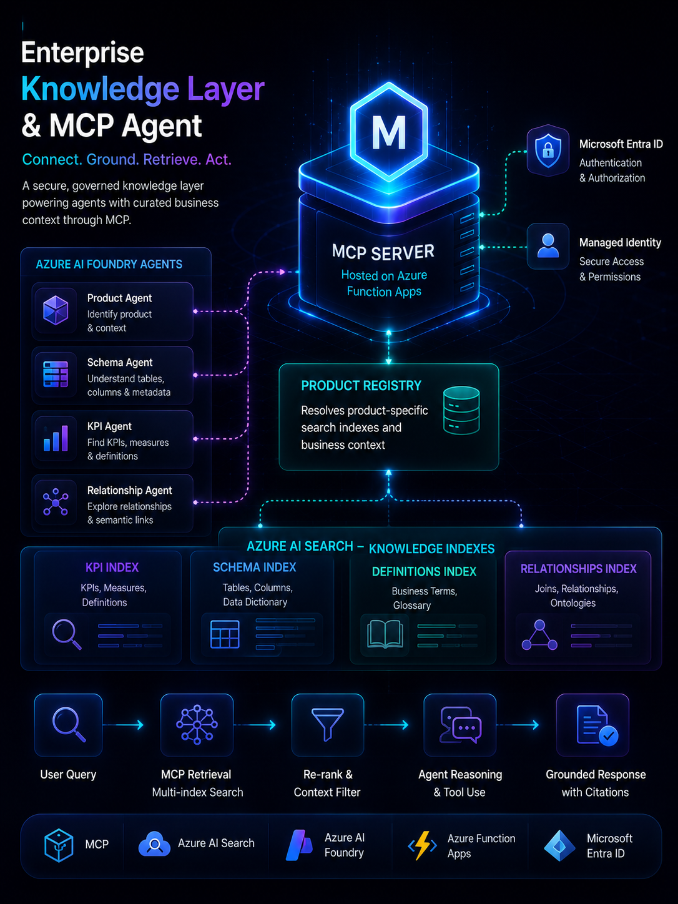
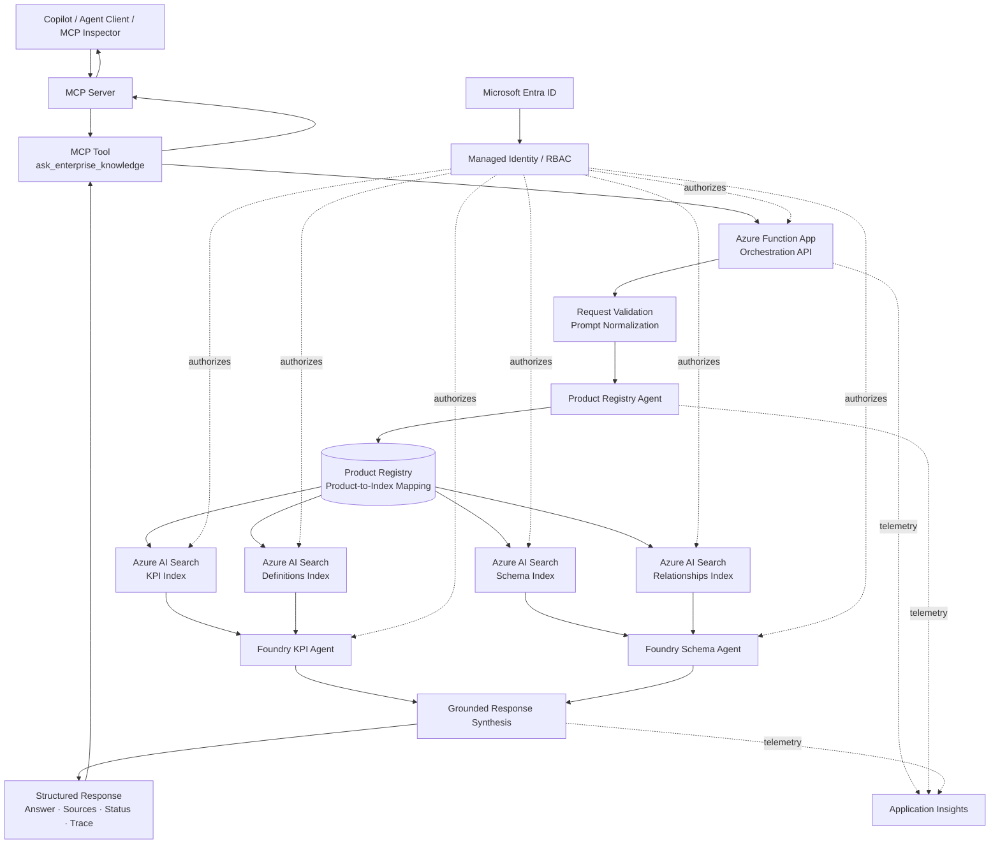
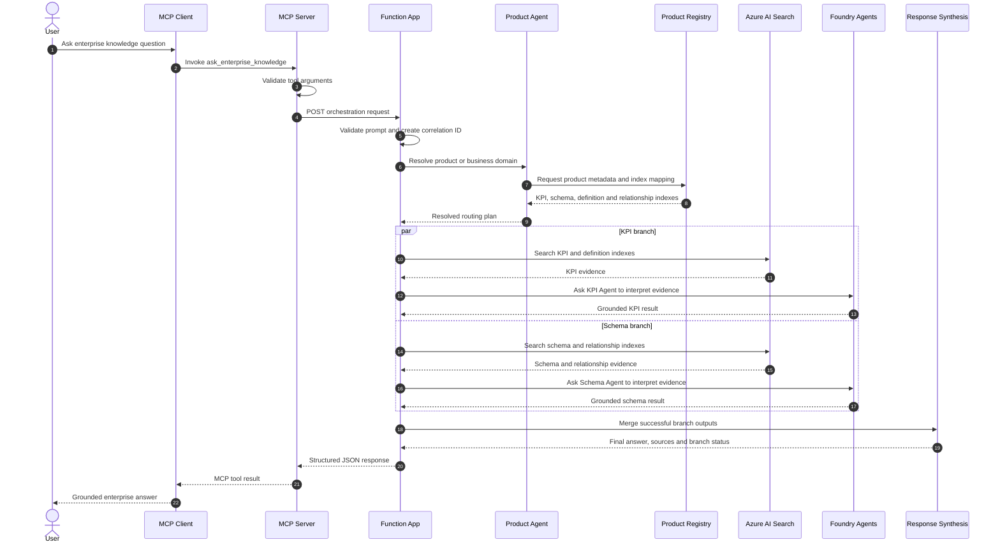
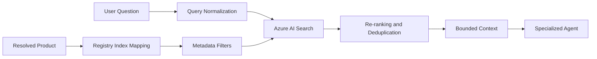
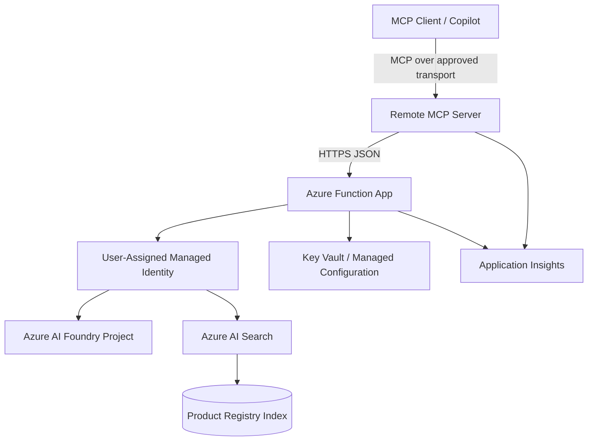

<p align="center">
  
</p>

<h1 align="center">Enterprise Knowledge Layer & MCP Agent</h1>

<p align="center">
  <strong>A secure, reusable knowledge layer that exposes governed enterprise context to AI agents through the Model Context Protocol.</strong>
</p>

<p align="center">
  MCP · Azure AI Search · Azure AI Foundry · Azure Function Apps · Microsoft Entra ID
</p>

---

> **Public-safe case study:** This README describes a sanitized, development-stage enterprise architecture. Internal product names, exact index names, private endpoints, tenant identifiers, credentials, prompts, and client-specific metadata are intentionally excluded.

## Overview

The **Enterprise Knowledge Layer & MCP Agent** is an agentic retrieval platform that turns fragmented business knowledge into a reusable and governed tool surface.

The system combines:

- a remote MCP server;
- an Azure Function App orchestration backend;
- a product registry;
- dedicated Azure AI Search indexes;
- focused Azure AI Foundry agents;
- identity-aware service integration;
- structured status and partial-failure handling.

External systems such as copilots, internal assistants, or other MCP-compatible clients can invoke a single knowledge tool rather than directly integrating with multiple search indexes and agent services.

A representative request such as:

> “What KPI should be used to answer this business question, which tables support it, and how are those tables related?”

is resolved through product identification, index routing, multi-index retrieval, specialized agent interpretation, and grounded response synthesis.

---

## Hiring Signal

This project demonstrates:

- MCP server and tool design;
- enterprise knowledge architecture;
- multi-index retrieval;
- agentic orchestration;
- Azure AI Foundry integration;
- Azure Function Apps backend engineering;
- Azure AI Search index routing;
- managed identity and RBAC patterns;
- grounded structured responses;
- partial-failure and dependency handling;
- reusable platform design.

---

## Table of Contents

1. [Problem Statement](#problem-statement)
2. [Objectives and Non-Goals](#objectives-and-non-goals)
3. [Impact Snapshot](#impact-snapshot)
4. [My Role](#my-role)
5. [Solution Overview](#solution-overview)
6. [High-Level Design](#high-level-design)
7. [End-to-End Workflow](#end-to-end-workflow)
8. [Low-Level Design](#low-level-design)
9. [MCP Tool Contract](#mcp-tool-contract)
10. [Product Registry](#product-registry)
11. [Knowledge Indexes](#knowledge-indexes)
12. [Agent Responsibilities](#agent-responsibilities)
13. [Retrieval and Grounding](#retrieval-and-grounding)
14. [Response Contract](#response-contract)
15. [Partial-Failure Design](#partial-failure-design)
16. [Security and Identity](#security-and-identity)
17. [Configuration](#configuration)
18. [Observability](#observability)
19. [Error Handling](#error-handling)
20. [Technology Stack](#technology-stack)
21. [Representative Repository Structure](#representative-repository-structure)
22. [Local Development](#local-development)
23. [Testing Strategy](#testing-strategy)
24. [Deployment Model](#deployment-model)
25. [Example Workflow Trace](#example-workflow-trace)
26. [Challenges and Resolutions](#challenges-and-resolutions)
27. [Engineering Decisions](#engineering-decisions)
28. [Limitations](#limitations)
29. [Future Enhancements](#future-enhancements)
30. [Impact Statement](#impact-statement)

---

## Problem Statement

Enterprise knowledge is frequently distributed across:

- KPI dictionaries;
- semantic-model metadata;
- report definitions;
- product-specific documentation;
- table and column catalogs;
- business glossaries;
- relationship and ontology definitions;
- several independently managed search indexes.

Traditional search can return relevant documents, but it does not reliably determine:

- which product or business domain the user means;
- which indexes should be queried;
- which KPI best matches the question;
- which tables and columns support that KPI;
- how the relevant entities are connected;
- whether the response is fully supported by available evidence.

Directly connecting every client to every knowledge source also creates duplicated integration logic, inconsistent authentication, and tightly coupled applications.

The platform therefore needed to provide a single, reusable interface that could resolve the business domain, retrieve the correct context, invoke specialized reasoning agents, and return a grounded response with transparent execution status.

---

## Objectives and Non-Goals

### Objectives

- Expose enterprise knowledge through a standard MCP tool.
- Keep the MCP interface thin and reusable.
- Resolve product or domain context before retrieval.
- Route requests to product-specific indexes.
- Retrieve KPI, schema, definition, and relationship context.
- Use specialized agents rather than one monolithic prompt.
- Return structured, grounded, and traceable responses.
- Support secure service-to-service access through Microsoft Entra ID.
- Handle missing indexes and partial branch failures gracefully.
- Make the architecture extensible to additional products and knowledge domains.

### Non-Goals

- Execute unrestricted SQL or business transactions.
- Give the LLM direct access to all enterprise data sources.
- Hardcode one set of indexes for every product.
- Treat search results as automatically correct.
- Hide failed retrieval branches behind a confident answer.
- Expose private resource names or credentials through MCP responses.
- Put orchestration and business logic inside the MCP transport layer.

---

## Impact Snapshot

| Area | Outcome |
|---|---|
| Integration | Exposed enterprise retrieval through a reusable MCP-compatible tool |
| Reuse | Separated client integration from backend orchestration |
| Grounding | Combined product, KPI, schema, definition, and relationship context |
| Extensibility | Added product-driven index resolution instead of hardcoded routing |
| Reliability | Supported partial success when one retrieval branch failed |
| Security | Used managed identity and RBAC-oriented service access |
| Operability | Returned structured branch status and trace metadata |
| Platform Value | Created a reusable foundation for additional copilots and agent clients |

> This project is presented as a development-stage architecture. No unsupported production-scale or accuracy metric is claimed.

---

## My Role

I worked across the knowledge, orchestration, integration, and reliability layers.

### Architecture

- Designed the knowledge-layer and MCP integration approach.
- Defined separation between the MCP interface, Function App orchestration, retrieval, and reasoning.
- Designed product-aware routing across several knowledge indexes.
- Structured the flow from user prompt to grounded final response.

### MCP and Backend Engineering

- Designed the MCP tool contract.
- Connected the MCP layer to the existing Function App backend.
- Kept the MCP server thin so core logic remained reusable outside MCP.
- Worked on HTTP request validation and structured JSON response design.

### Agentic Orchestration

- Integrated focused Foundry agents for:
  - product resolution;
  - KPI identification;
  - schema interpretation;
  - relationship reasoning.
- Designed parallel KPI and schema/relationship branches.
- Supported final response synthesis from multiple agent outputs.

### Retrieval

- Integrated Azure AI Search indexes.
- Added product-specific index resolution.
- Combined schema and relationship evidence for richer data-model reasoning.
- Preserved search status, source references, and failure information.

### Security and Reliability

- Worked with Managed Identity and RBAC-based access patterns.
- Debugged Foundry firewall and VNet restrictions.
- Debugged missing-index and endpoint configuration issues.
- Added partial-failure handling so one failed branch did not destroy a valid response.
- Supported environment-driven deployment configuration.

---

## Solution Overview

The system uses four main architectural layers.

### 1. MCP Interface Layer

Provides a stable tool contract for external agent clients.

Responsibilities:

- receive tool arguments;
- validate request shape;
- call the backend orchestration endpoint;
- normalize the backend response;
- return MCP-compatible structured content.

### 2. Function App Orchestration Layer

Owns the main execution flow.

Responsibilities:

- validate the request;
- resolve the product;
- determine which indexes are needed;
- execute retrieval branches;
- invoke Foundry agents;
- merge branch results;
- return final status and answer.

### 3. Knowledge Retrieval Layer

Contains separate Azure AI Search indexes for different knowledge types.

Typical index categories:

- product registry;
- KPI definitions;
- schema metadata;
- business definitions;
- relationships and ontologies.

### 4. Agent Reasoning Layer

Uses specialized agents to interpret retrieved evidence.

Typical agents:

- Product Agent;
- KPI Agent;
- Schema Agent;
- Relationship reasoning capability;
- final synthesis logic.

---

## High-Level Design



### Architectural Boundaries

| Layer | Responsibility |
|---|---|
| Client Layer | Initiates a knowledge request |
| MCP Layer | Standard tool discovery and invocation |
| API Layer | Authentication, validation, and request lifecycle |
| Registry Layer | Product and index resolution |
| Retrieval Layer | Multi-index enterprise search |
| Agent Layer | KPI, schema, and relationship interpretation |
| Synthesis Layer | Merge grounded branch outputs |
| Security Layer | Entra ID, managed identity, and RBAC |
| Observability Layer | Logs, timings, failures, and branch status |

---

## End-to-End Workflow



---

## Low-Level Design

### Core Components

| Component | Responsibility |
|---|---|
| MCP Tool Handler | Validates tool input and calls the backend |
| HTTP Client | Handles backend timeout, retry, and response parsing |
| Function Trigger | Receives the orchestration request |
| Request Validator | Validates prompt, `top_k`, and optional routing controls |
| Product Resolver | Identifies the product or domain |
| Registry Service | Returns product-specific index configuration |
| Search Service | Executes filtered Azure AI Search queries |
| Foundry Client | Invokes specialized agents |
| Branch Coordinator | Runs independent branches and records status |
| Response Synthesizer | Combines grounded outputs |
| Error Mapper | Converts failures into safe response states |
| Telemetry Service | Emits correlation and stage-level logs |

### Representative Request Schema

```python
from pydantic import BaseModel, Field


class KnowledgeRequest(BaseModel):
    prompt: str = Field(min_length=3, max_length=5000)
    product_hint: str | None = None
    top_k: int = Field(default=5, ge=1, le=20)
    process_indexes: list[str] | None = None
    include_sources: bool = True
    include_trace: bool = False
```

### Internal Branch State

```python
from typing import Any, Literal
from pydantic import BaseModel, Field


class BranchResult(BaseModel):
    branch: Literal["kpi", "schema_relationship"]
    status: Literal["success", "failed", "skipped"]
    search_count: int = 0
    sources: list[dict[str, Any]] = Field(default_factory=list)
    agent_output: dict[str, Any] | None = None
    error_code: str | None = None
    error_message: str | None = None


class KnowledgeExecutionState(BaseModel):
    correlation_id: str
    prompt: str
    product_name: str | None = None
    resolved_indexes: dict[str, str] = Field(default_factory=dict)
    branches: list[BranchResult] = Field(default_factory=list)
    final_status: Literal[
        "success",
        "partial_success",
        "failed",
    ] = "failed"
```

### Representative Orchestration

```python
async def execute_knowledge_request(
    request: KnowledgeRequest,
) -> KnowledgeExecutionState:
    state = KnowledgeExecutionState(
        correlation_id=create_correlation_id(),
        prompt=request.prompt,
    )

    product = await product_resolver.resolve(
        prompt=request.prompt,
        product_hint=request.product_hint,
    )

    state.product_name = product.product_name
    state.resolved_indexes = registry.resolve_indexes(product.product_name)

    kpi_result, schema_result = await asyncio.gather(
        run_kpi_branch(request, state.resolved_indexes),
        run_schema_branch(request, state.resolved_indexes),
        return_exceptions=True,
    )

    state.branches = normalize_branch_results(
        kpi_result,
        schema_result,
    )
    state.final_status = derive_final_status(state.branches)

    return state
```

### Final Status Derivation

```python
def derive_final_status(
    branches: list[BranchResult],
) -> str:
    successful = sum(branch.status == "success" for branch in branches)
    failed = sum(branch.status == "failed" for branch in branches)

    if successful and not failed:
        return "success"
    if successful and failed:
        return "partial_success"
    return "failed"
```

---

## MCP Tool Contract

The MCP layer intentionally exposes a small, stable tool surface.

### Tool Name

```text
ask_enterprise_knowledge
```

### Tool Description

```text
Retrieve grounded KPI, schema, definition, and relationship context
for an enterprise business question.
```

### Input Schema

```json
{
  "type": "object",
  "properties": {
    "prompt": {
      "type": "string",
      "description": "Natural-language enterprise knowledge question."
    },
    "product_hint": {
      "type": "string",
      "description": "Optional product or business-domain hint."
    },
    "top_k": {
      "type": "integer",
      "minimum": 1,
      "maximum": 20,
      "default": 5
    },
    "process_indexes": {
      "type": "array",
      "items": {
        "type": "string"
      },
      "description": "Optional allow-list of knowledge branches."
    },
    "include_sources": {
      "type": "boolean",
      "default": true
    }
  },
  "required": [
    "prompt"
  ]
}
```

### Tool Handler Pattern

```python
@mcp.tool()
async def ask_enterprise_knowledge(
    prompt: str,
    product_hint: str | None = None,
    top_k: int = 5,
    process_indexes: list[str] | None = None,
    include_sources: bool = True,
) -> dict:
    payload = {
        "prompt": prompt,
        "product_hint": product_hint,
        "top_k": top_k,
        "process_indexes": process_indexes,
        "include_sources": include_sources,
    }

    return await backend_client.post_json(
        path="/api/knowledge/query",
        payload=payload,
    )
```

### Why the MCP Layer Stays Thin

The MCP server does not own:

- product resolution;
- index selection;
- search logic;
- Foundry prompts;
- response synthesis;
- business rules.

This keeps the same backend reusable from MCP, Logic Apps, Copilot, a web API, or other clients.

---

## Product Registry

The product registry maps a resolved product or domain to the knowledge assets required for that product.

### Representative Record

```json
{
  "product_id": "product-001",
  "display_name": "Example Product",
  "aliases": [
    "Example",
    "Product One"
  ],
  "indexes": {
    "kpi": "example-kpi-index",
    "schema": "example-schema-index",
    "definitions": "example-definition-index",
    "relationships": "example-relationship-index"
  },
  "enabled_agents": [
    "kpi",
    "schema"
  ],
  "status": "active"
}
```

### Responsibilities

- normalize product aliases;
- prevent hardcoded index names in orchestration code;
- verify required indexes are configured;
- support per-product capabilities;
- enable product onboarding without rewriting the MCP tool;
- provide a single source of truth for index routing.

### Product Resolution States

| State | Behavior |
|---|---|
| Exact product match | Use configured indexes |
| Alias match | Resolve to canonical product |
| Multiple matches | Request clarification |
| No match | Return controlled unsupported-product state |
| Product disabled | Return unavailable status |
| Missing required index | Mark affected branch failed before search |

---

## Knowledge Indexes

### KPI Index

Stores:

- KPI names;
- aliases;
- business definitions;
- measures;
- dimensions;
- approved filters;
- methodology;
- report references.

### Schema Index

Stores:

- table names;
- column names;
- data types;
- business descriptions;
- semantic roles;
- source-system context.

### Definitions Index

Stores:

- business glossary terms;
- domain definitions;
- acronyms;
- report terminology;
- synonyms and aliases.

### Relationships Index

Stores:

- entity relationships;
- table joins;
- cardinality;
- semantic links;
- ontology relationships;
- relationship explanations.

### Why Separate Indexes?

Separate indexes provide:

- cleaner ownership;
- targeted ranking;
- different schemas by knowledge type;
- smaller retrieval contexts;
- independent refresh cycles;
- better error isolation;
- per-product routing.

---

## Agent Responsibilities

### Product Agent

Input:

- user prompt;
- optional product hint;
- registry context.

Output:

- canonical product;
- confidence;
- required knowledge branches;
- ambiguity or unsupported status.

The Product Agent does not answer the business question. It creates the routing plan.

### KPI Agent

Input:

- user question;
- KPI and definition search results.

Responsibilities:

- identify the closest supported KPI;
- explain the KPI meaning;
- identify relevant measure, dimensions, and filters;
- preserve source references;
- state when the retrieved context is insufficient.

### Schema Agent

Input:

- user question;
- schema and relationship search results;
- optional resolved KPI result.

Responsibilities:

- identify relevant tables and columns;
- explain entity relationships;
- connect business concepts to schema metadata;
- recommend supported joins or navigation paths;
- avoid inventing unavailable fields.

### Response Synthesizer

Responsibilities:

- combine successful agent outputs;
- distinguish evidence from inference;
- retain branch-level warnings;
- generate a concise grounded answer;
- include sources when requested;
- preserve `partial_success` state.

---

## Retrieval and Grounding

### Retrieval Pipeline



### Search Controls

- product-specific index selection;
- `top_k` bounds;
- semantic or vector retrieval;
- metadata filtering;
- score thresholds;
- deduplication;
- context-size limits;
- source ID retention;
- branch-specific queries.

### Grounding Contract

A branch is considered grounded only when:

- its required index was resolved;
- search returned usable evidence;
- the agent output references retrieved context;
- unsupported facts are not introduced;
- source references are preserved;
- ambiguous findings are marked explicitly.

---

## Response Contract

### Representative Response

```python
from typing import Any, Literal
from pydantic import BaseModel, Field


class KnowledgeResponse(BaseModel):
    request_id: str
    status: Literal[
        "success",
        "partial_success",
        "failed",
    ]
    product: str | None
    answer: str | None
    kpi: dict[str, Any] | None
    schema: dict[str, Any] | None
    sources: list[dict[str, Any]] = Field(default_factory=list)
    branches: list[BranchResult] = Field(default_factory=list)
    warnings: list[str] = Field(default_factory=list)
    errors: list[dict[str, str]] = Field(default_factory=list)
    latency_ms: int
```

### Example JSON

```json
{
  "request_id": "req-82f3",
  "status": "partial_success",
  "product": "Example Product",
  "answer": "A matching KPI definition was found. Schema context is currently unavailable, so no table recommendation is included.",
  "kpi": {
    "name": "Resolved KPI",
    "definition": "Approved enterprise definition",
    "dimensions": [
      "region",
      "period"
    ]
  },
  "schema": null,
  "sources": [
    {
      "index_type": "kpi",
      "document_id": "kpi-101",
      "score": 0.91
    }
  ],
  "branches": [
    {
      "branch": "kpi",
      "status": "success",
      "search_count": 5
    },
    {
      "branch": "schema_relationship",
      "status": "failed",
      "search_count": 0,
      "error_code": "INDEX_NOT_FOUND"
    }
  ],
  "warnings": [
    "Schema and relationship context could not be retrieved."
  ],
  "errors": [],
  "latency_ms": 6840
}
```

---

## Partial-Failure Design

A core design requirement is that one failed branch must not erase valid work from another branch.

### Status Model

| KPI Branch | Schema Branch | Final Status |
|---|---|---|
| Success | Success | `success` |
| Success | Failed | `partial_success` |
| Failed | Success | `partial_success` |
| Failed | Failed | `failed` |
| Skipped | Success | `success` |
| Skipped | Failed | `failed` |

### Partial-Success Rules

- Return successful grounded output.
- Do not fabricate content for the failed branch.
- Include a branch warning.
- Include a machine-readable error code.
- Preserve sources from successful branches.
- Avoid exposing internal endpoints or stack traces.
- Allow the caller to decide whether to retry.

---

## Security and Identity

### Identity Pattern

```text
MCP Client
  -> authenticated MCP or API channel
  -> Function App identity
  -> Azure AI Search
  -> Azure AI Foundry
```

### Managed Identity

The Function App uses a user-assigned or system-assigned managed identity to obtain tokens for downstream Azure services.

Typical token scopes:

```text
Azure AI Foundry / AI services scope
Azure Search service scope
```

### RBAC

Representative role categories:

- Foundry project user or equivalent;
- Azure AI developer access;
- Search index data reader;
- storage access where required;
- Function App invocation permission.

Exact roles depend on the deployment model and should be granted at the narrowest practical scope.

### Network Controls

- private endpoint or VNet-aware access where required;
- Foundry firewall allow-listing;
- restricted Search access;
- no direct browser-to-index communication;
- secure outbound connectivity from the Function App;
- production HTTPS only.

### Secret Handling

- no hardcoded keys;
- environment variables or managed configuration;
- Key Vault for secrets that cannot use identity;
- no tokens in logs;
- no private resource URLs in user-visible responses.

---

## Configuration

Representative environment variables:

```text
FOUNDRY_PROJECT_ENDPOINT
FOUNDRY_TOKEN_SCOPE
PRODUCT_AGENT_NAME
KPI_AGENT_NAME
SCHEMA_AGENT_NAME

AZURE_SEARCH_ENDPOINT
PRODUCT_REGISTRY_INDEX
DEFAULT_TOP_K

AZURE_CLIENT_ID
RELATIONSHIP_REQUIRED_FOR_SCHEMA
PROCESS_INDEXES
```

### Configuration Principles

- fail fast when required configuration is missing;
- log only whether a variable is configured, never its value;
- keep product-specific index names in the registry;
- separate development, test, and production configuration;
- redeploy after environment changes;
- validate index existence during startup or health checks where practical.

---

## Observability

Each request is assigned a correlation ID that follows the complete execution path.

### Recommended Telemetry

| Area | Fields |
|---|---|
| MCP | tool name, invocation ID, validation result |
| API | route, method, status, duration |
| Product Resolution | product, confidence, registry result |
| Search | index type, index name hash, top-k, result count |
| Agent | agent name, duration, structured-output validation |
| Branch | branch name, status, error code |
| Synthesis | final status, source count, warning count |
| Identity | token acquisition status, never token value |
| Network | dependency name and safe failure category |

### Health Endpoints

```text
GET /api/health
GET /api/readiness
```

Readiness can verify:

- required environment variables;
- product registry connectivity;
- required index configuration;
- downstream identity acquisition;
- optional Foundry reachability.

---

## Error Handling

| Failure | Controlled Behavior |
|---|---|
| Invalid MCP arguments | Return input-validation error |
| Empty prompt | Reject before backend invocation |
| Unsupported product | Return clarification or unsupported status |
| Ambiguous product | Return candidate products |
| Missing index mapping | Fail only the affected branch |
| Search index 404 | Return `INDEX_NOT_FOUND` |
| Search authentication failure | Return dependency-authentication error |
| Foundry 401/403 | Return identity or network access error |
| Foundry firewall restriction | Return dependency-network error |
| Agent timeout | Mark branch failed and preserve other branch |
| Invalid structured agent output | Retry within configured limit |
| All branches fail | Return final `failed` state |
| One branch succeeds | Return `partial_success` |
| Environment mismatch | Fail readiness with safe diagnostic |
| Unexpected exception | Log correlation ID and return generic safe error |

---

## Technology Stack

| Area | Technology |
|---|---|
| Language | Python |
| Protocol | Model Context Protocol |
| MCP Server | Python MCP SDK / compatible server framework |
| Backend | Azure Function Apps |
| Agent Platform | Azure AI Foundry |
| LLM | Azure OpenAI / Foundry model deployments |
| Retrieval | Azure AI Search |
| Knowledge Routing | Product Registry |
| Workflow Integration | Logic Apps / Copilot-compatible clients |
| Identity | Microsoft Entra ID |
| Authentication | Managed Identity |
| Authorization | Azure RBAC |
| Monitoring | Application Insights / Azure Monitor |
| Data Contracts | JSON and Pydantic |
| HTTP | Async HTTP client |
| Deployment | Azure Functions package deployment |

---

## Representative Repository Structure

```text
enterprise-knowledge-layer-mcp/
├── assets/
│   └── enterprise-knowledge-layer-mcp.png
├── mcp_server/
│   ├── server.py
│   ├── tools/
│   │   └── enterprise_knowledge.py
│   ├── clients/
│   │   └── backend_client.py
│   ├── contracts/
│   │   ├── tool_input.py
│   │   └── tool_output.py
│   └── config.py
├── function_app/
│   ├── function_app.py
│   ├── routes/
│   │   ├── health.py
│   │   └── knowledge.py
│   ├── orchestration/
│   │   ├── coordinator.py
│   │   ├── branch_runner.py
│   │   └── synthesis.py
│   ├── agents/
│   │   ├── product_agent.py
│   │   ├── kpi_agent.py
│   │   └── schema_agent.py
│   ├── registry/
│   │   ├── client.py
│   │   └── models.py
│   ├── search/
│   │   ├── azure_search.py
│   │   ├── query_builder.py
│   │   └── result_normalizer.py
│   ├── identity/
│   │   └── credential_provider.py
│   ├── contracts/
│   │   ├── requests.py
│   │   ├── responses.py
│   │   └── state.py
│   ├── observability/
│   │   ├── logging.py
│   │   └── telemetry.py
│   └── errors/
│       └── error_mapper.py
├── tests/
│   ├── unit/
│   ├── integration/
│   ├── contract/
│   └── fixtures/
├── host.json
├── requirements.txt
├── .env.example
└── README.md
```

---

## Local Development

### 1. Create an Environment

```bash
python -m venv .venv
```

```bash
# Windows
.venv\Scripts\activate
```

```bash
# macOS / Linux
source .venv/bin/activate
```

### 2. Install Dependencies

```bash
pip install -r requirements.txt
```

### 3. Configure Local Settings

Create an untracked local configuration file or export environment variables.

```json
{
  "IsEncrypted": false,
  "Values": {
    "FUNCTIONS_WORKER_RUNTIME": "python",
    "FOUNDRY_PROJECT_ENDPOINT": "configured-locally",
    "AZURE_SEARCH_ENDPOINT": "configured-locally",
    "PRODUCT_REGISTRY_INDEX": "configured-locally",
    "AZURE_CLIENT_ID": "configured-locally"
  }
}
```

### 4. Run the Function App

```bash
func start
```

### 5. Run the MCP Server

```bash
python -m mcp_server.server
```

### 6. Test the Tool

Use an MCP-compatible inspector or client to invoke:

```text
ask_enterprise_knowledge
```

Representative arguments:

```json
{
  "prompt": "Which KPI measures branded search activity and which model fields support it?",
  "product_hint": "Example Product",
  "top_k": 5,
  "include_sources": true
}
```

---

## Testing Strategy

### Unit Tests

- MCP argument validation;
- product alias resolution;
- registry lookup;
- branch status derivation;
- search-query construction;
- source normalization;
- safe error mapping;
- response serialization.

### Contract Tests

- MCP input schema;
- MCP tool response schema;
- Function API request and response;
- partial-success payload;
- unsupported-product payload;
- backward compatibility.

### Search Tests

- KPI index retrieval;
- schema index retrieval;
- relationship index retrieval;
- top-k enforcement;
- product filtering;
- source ID preservation;
- missing-index handling.

### Agent Tests

- product resolution;
- KPI structured output;
- schema structured output;
- ambiguous context;
- insufficient evidence;
- malformed model output;
- retry limits.

### Identity and Network Tests

- managed identity token acquisition;
- RBAC failure behavior;
- Foundry firewall restriction;
- Search permission failure;
- private-network connectivity;
- environment-specific endpoint selection.

### Integration Tests

- MCP server to Function App;
- Function App to product registry;
- Function App to Azure AI Search;
- Function App to Foundry agents;
- successful dual-branch request;
- KPI-only partial success;
- schema-only partial success;
- complete dependency failure.

### Resilience Tests

- one index unavailable;
- one agent timeout;
- registry record missing;
- malformed registry record;
- transient HTTP failure;
- environment variable missing;
- duplicate source records;
- empty search result.

---

## Deployment Model



### Deployment Characteristics

- MCP interface deployed independently from core orchestration where required.
- Azure Function App hosts the backend workflow.
- Product and index configuration remains environment-driven.
- Managed Identity is used for Azure dependencies.
- Application Insights captures branch-level telemetry.
- Network and firewall rules are validated before production testing.
- No client directly accesses Foundry or Search.

---

## Example Workflow Trace

### User Request

```text
What is the KPI for branded keywords on a search channel in the selected market,
and which tables and filters support that KPI?
```

### Product Resolution

```json
{
  "product": "Example Product",
  "confidence": 0.96,
  "required_branches": [
    "kpi",
    "schema_relationship"
  ]
}
```

### Registry Resolution

```json
{
  "kpi_index": "example-kpi-index",
  "schema_index": "example-schema-index",
  "definitions_index": "example-definition-index",
  "relationship_index": "example-relationship-index"
}
```

### KPI Branch

```json
{
  "status": "success",
  "kpi": {
    "name": "Example Branded Keyword KPI",
    "definition": "Distinct count of qualifying branded keyword entities.",
    "dimensions": [
      "market",
      "channel",
      "solution_area"
    ]
  },
  "sources": [
    "kpi-document-id"
  ]
}
```

### Schema Branch

```json
{
  "status": "success",
  "tables": [
    "keyword_dimension",
    "market_dimension",
    "activity_fact"
  ],
  "relationships": [
    "activity_fact.keyword_id -> keyword_dimension.keyword_id",
    "activity_fact.market_id -> market_dimension.market_id"
  ],
  "sources": [
    "schema-document-id",
    "relationship-document-id"
  ]
}
```

### Final Response

The synthesizer returns:

- resolved KPI;
- business definition;
- supported filters and dimensions;
- relevant tables;
- relationship explanation;
- source references;
- branch statuses;
- grounded answer.

---

## Challenges and Resolutions

### Product-Specific Index Routing

**Challenge:** Different products require different search indexes.

**Resolution:** Introduced a product registry that returns the required index mapping instead of hardcoding index names.

### Missing Search Indexes

**Challenge:** A configured index may be absent or incorrectly named, producing a 404.

**Resolution:** Validate registry records, classify `INDEX_NOT_FOUND`, fail only the affected branch, and preserve other grounded results.

### Foundry Firewall Restrictions

**Challenge:** Agent calls can fail even with valid credentials when VNet or firewall rules block access.

**Resolution:** Separate identity failures from network failures, verify private access paths, and surface a dependency-network diagnostic.

### Managed Identity Permissions

**Challenge:** Recreated or changed identities may not retain earlier role assignments.

**Resolution:** Use environment-specific identity configuration, verify RBAC systematically, and test token acquisition during readiness checks.

### Schema and Relationship Coupling

**Challenge:** Schema reasoning may require both table metadata and relationship context.

**Resolution:** Retrieve both sources into the same schema branch and expose a configuration flag controlling whether relationship context is mandatory.

### Partial Success

**Challenge:** KPI retrieval may work while schema retrieval fails.

**Resolution:** Return `partial_success`, preserve valid KPI output, and clearly state that schema guidance is unavailable.

### MCP and Backend Duplication

**Challenge:** Putting orchestration inside the MCP tool would tightly couple the system to MCP.

**Resolution:** Keep the MCP layer as an adapter and retain the Function App as the reusable backend.

---

## Engineering Decisions

### MCP as an Interface, Not the Business Layer

**Decision:** Keep the MCP server thin.

**Reason:** The same backend can serve multiple clients and protocols without duplicating knowledge logic.

### Product Registry Before Search

**Decision:** Resolve product context before selecting indexes.

**Reason:** Product-specific routing improves relevance and avoids cross-domain retrieval.

### Separate Knowledge Indexes

**Decision:** Store KPI, schema, definition, and relationship content separately.

**Reason:** Each knowledge type has different metadata, ranking, ownership, and refresh requirements.

### Focused Agents

**Decision:** Use separate product, KPI, and schema responsibilities.

**Reason:** Smaller roles improve traceability, testing, and prompt control.

### Parallel Independent Branches

**Decision:** Run KPI and schema branches concurrently when possible.

**Reason:** They use independent sources and parallel execution reduces latency.

### Structured Partial Success

**Decision:** Model branch outcomes explicitly.

**Reason:** Enterprise systems should preserve valid work and make dependency failures visible.

### Managed Identity First

**Decision:** Prefer identity-based service authentication over static keys.

**Reason:** It reduces secret distribution and aligns with Azure least-privilege patterns.

---

## Limitations

- The final answer is only as current as the indexed knowledge.
- New products require registry records and appropriate indexes.
- Missing or weak relationship metadata limits schema reasoning.
- Ambiguous product names may require clarification.
- MCP transport security depends on the selected hosting model.
- Search relevance must be evaluated separately for each knowledge type.
- The architecture does not directly execute business transactions.
- Public documentation excludes confidential prompts, indexes, and resource names.
- The project is presented as development-stage rather than a claim of full production rollout.

---

## Future Enhancements

- Add automated product onboarding.
- Add index-existence and schema validation during deployment.
- Introduce source citations in a standard MCP response format.
- Add an MCP resource interface for browsable product metadata.
- Add more granular knowledge tools in addition to the unified tool.
- Add streaming branch-status updates.
- Add model fallback and circuit-breaker behavior.
- Add retrieval and agent quality evaluation dashboards.
- Add automated stale-index detection.
- Add policy-as-code for allowed products and knowledge branches.
- Add human confirmation for ambiguous product resolution.
- Add semantic caching for repeated enterprise questions.
- Add a shared ontology layer across products.
- Add OpenTelemetry traces across MCP and Function App boundaries.

---

## Impact Statement

The Enterprise Knowledge Layer & MCP Agent created a reusable boundary between AI clients and fragmented enterprise knowledge systems.

Instead of forcing each copilot or agent to understand product routing, search indexes, Foundry agents, authentication, and partial failures, the platform exposes a single structured knowledge tool.

The architecture:

- made KPI, schema, definition, and relationship knowledge accessible through natural language;
- standardized access through MCP;
- separated client integration from backend orchestration;
- enabled product-specific multi-index routing;
- supported grounded responses from focused agents;
- used managed identity and RBAC-oriented access patterns;
- preserved valid results during partial dependency failures;
- created a reusable foundation for additional products, copilots, and enterprise knowledge domains.

---

## Portfolio Summary

> Designed an MCP-compatible enterprise knowledge platform that resolves product context, routes requests across Azure AI Search indexes, invokes specialized Azure AI Foundry agents, and returns grounded KPI and schema answers through a secure Azure Function Apps backend with managed identity and partial-failure support.

---

## Contact

**Satnam Singh**  
Agentic GenAI Developer · Python Backend Developer · MCP and Azure AI Engineer

- Portfolio: `satnamsingh.in`
- LinkedIn: `linkedin.com/in/22satnam`
- GitHub: `github.com/22satnam`
- Email: `satnamsjob@gmail.com`

---

<p align="center">
  <strong>Connect. Ground. Retrieve. Act.</strong>
</p>
